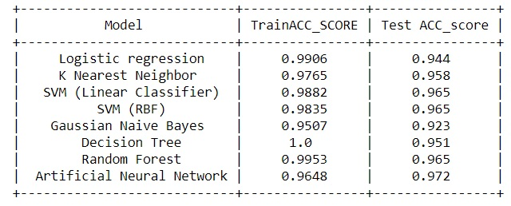

# Breast-cancer-Detection
  The Data is taken from - https://www.kaggle.com/uciml/breast-cancer-wisconsin-data
 
<html lang="en">
<head>
    <title>Breast Cancer Wisconsin (Diagnostic) Data Set | Kaggle</title>
    <meta charset="utf-8" />
    <meta name="robots" content="index, follow" />
    <meta name="description" content="Predict whether the cancer is benign or malignant" />
    <meta name="turbolinks-cache-control" content="no-cache" />
        <meta name="keywords" content="mathematics,healthcare,cancer" />
        <meta name="viewport" content="width=device-width, initial-scale=1.0, maximum-scale=5.0, minimum-scale=1.0">
    <meta name="theme-color" content="#008ABC" />
    
    <link rel="preconnect" href="https://www.google-analytics.com" crossorigin="anonymous" /><link rel="preconnect" href="https://stats.g.doubleclick.net" /><link rel="preconnect" href="https://js.intercomcdn.com" /><link rel="preconnect" href="https://storage.googleapis.com" /><link rel="preconnect" href="https://apis.google.com" /><link rel="preload" href="/static/assets/fontawesome-webfont.woff2" as="font" crossorigin="anonymous" />
    <link href="/static/images/favicon.ico" rel="shortcut icon" type="image/x-icon" />
    <link rel="manifest" href="/static/json/manifest.json" crossorigin="use-credentials">
    <link href="//fonts.googleapis.com/css?family=Open+Sans:400,300,300italic,400italic,600,600italic,700,700italic" rel='stylesheet' type='text/css'>
    <link href="https://fonts.googleapis.com/icon?family=Google+Material+Icons" rel="stylesheet" type='text/css' />
        <link rel="stylesheet" type="text/css" href="/static/assets/vendor.css?v=8ba2ade212fb9c891959" />
        <link rel="stylesheet" type="text/css" href="/static/assets/app.css?v=f313691f4421aa24a0fc" />
 
The results are :  
